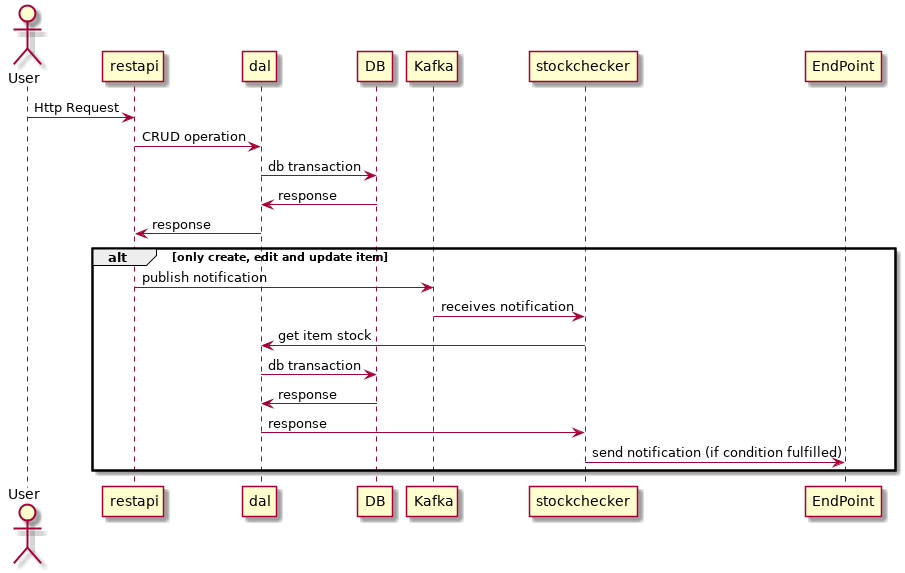
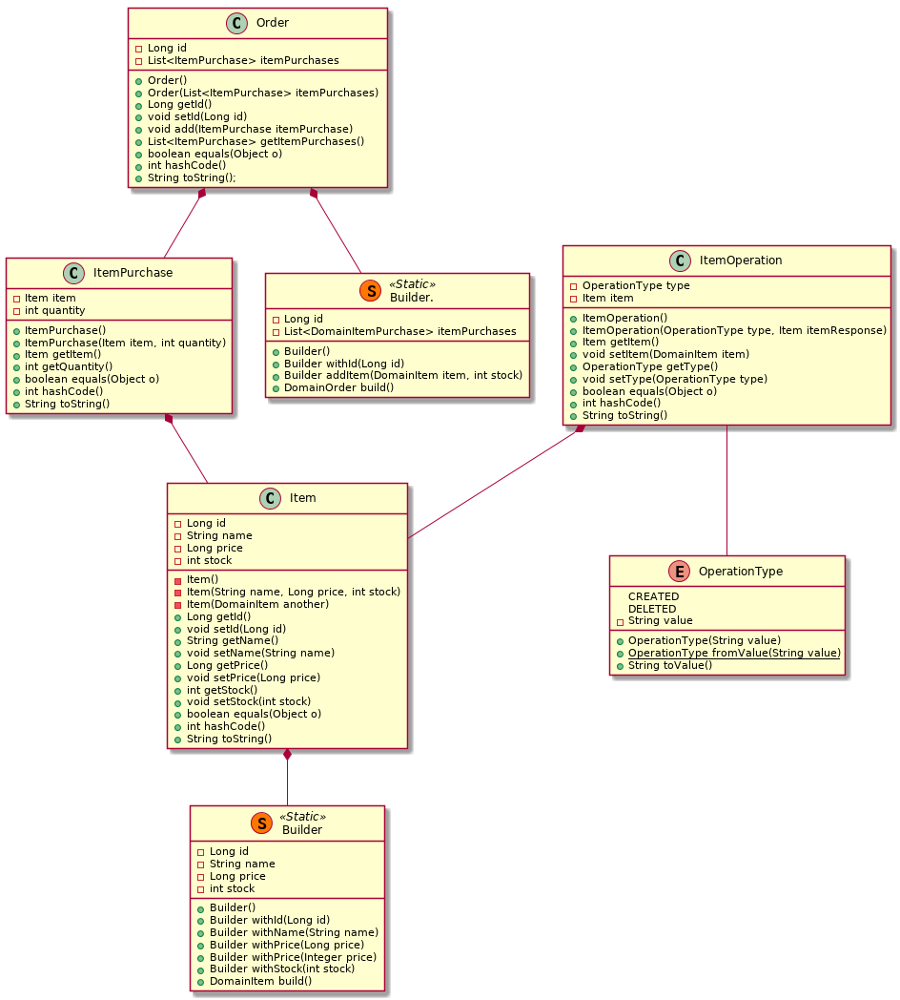

[](https://travis-ci.org/alb3rtobr/tfm_swcraftsmanship)

- [1. Introduction](#1-introduction)
  - [1.1. Project description](#11-project-description)
  - [1.2. Goals](#12-goals)
  - [1.3. Motivation](#13-motivation)
- [2. Theoretical framework](#2-theoretical-framework)
- [3. State of the art](#3-state-of-the-art)
  - [3.1. Kubernetes](#31-kubernetes)
    - [3.1.1. Minikube](#311-minikube)
    - [3.1.2. Helm](#312-helm)
  - [3.2. Microservices communication](#32-microservices-communication)
    - [3.2.1. REST](#321-rest)
    - [3.2.2. gRPC](#322-grpc)
    - [3.2.3. Apache Kafka](#323-apache-kafka)
  - [3.3. Persistence](#33-persistence)
    - [3.3.1. JPA, Hibernate & Spring Data JPA](#331-jpa-hibernate--spring-data-jpa)
    - [3.3.2. H2 & MySQL](#332-h2--mysql)
  - [3.4. Monitoring](#34-monitoring)
    - [3.4.1. Logging](#341-logging)
      - [3.4.1.1. Elastic Stack](#3411-elastic-stack)
        - [3.4.1.1.1. Data ingestion: Logstash & Beats](#34111-data-ingestion-logstash--beats)
        - [3.4.1.1.2. Data storage, index and analysis: Elasticsearch](#34112-data-storage-index-and-analysis-elasticsearch)
        - [3.4.1.1.3. User interface: Kibana](#34113-user-interface-kibana)
    - [3.4.2. Metrics](#342-metrics)
    - [3.4.3. Tracing](#343-tracing)
  - [3.5. Spring framework](#35-spring-framework)
- [4. Project development](#4-project-development)
  - [4.1. Methodology](#41-methodology)
  - [4.2. Analysis](#42-analysis)
  - [4.3. Design](#43-design)
  - [4.4. Iterations](#44-iterations)
    - [4.4.1. Version 0.1](#441-version-01)
      - [4.4.1.1. Analysis and Design](#4411-analysis-and-design)
        - [4.4.1.1.1. Use cases](#44111-use-cases)
        - [4.4.1.1.2. Data Model](#44112-data-model)
        - [4.4.1.1.3. Class Diagrams](#44113-class-diagrams)
        - [4.4.1.1.4. Sequence Diagrams](#44114-sequence-diagrams)
      - [4.4.1.2. Implementation and Deployment](#4412-implementation-and-deployment)
    - [4.4.2. Version 0.2](#442-version-02)
      - [4.4.2.1. Analysis and Design](#4421-analysis-and-design)
        - [4.4.2.1.1. Use cases](#44211-use-cases)
        - [4.4.2.1.2. Data Model](#44212-data-model)
        - [4.4.2.1.3. Class Diagrams?](#44213-class-diagrams)
        - [4.4.2.1.4. Sequence Diagrams?](#44214-sequence-diagrams)
      - [4.4.2.2. Implementation and Deployment](#4422-implementation-and-deployment)
    - [4.4.3. Version 0.3](#443-version-03)
      - [4.4.3.1. Analysis and Design](#4431-analysis-and-design)
        - [4.4.3.1.1. Use cases](#44311-use-cases)
        - [4.4.3.1.2. Data Model](#44312-data-model)
        - [4.4.3.1.3. Class Diagrams?](#44313-class-diagrams)
        - [4.4.3.1.4. Sequence Diagrams?](#44314-sequence-diagrams)
      - [4.4.3.2. Implementation and Deployment](#4432-implementation-and-deployment)
  - [4.5. Implementation and tests](#45-implementation-and-tests)
    - [4.5.1. Version 0.1](#451-version-01)
    - [4.5.2. Version 0.2](#452-version-02)
    - [4.5.3. Version 0.3](#453-version-03)
      - [4.5.3.1. Prometheus](#4531-prometheus)
      - [4.5.3.2. Grafana](#4532-grafana)
      - [4.5.3.3 Elasticsearch](#4533-elasticsearch)
  - [4.6. Deployment](#46-deployment)
    - [4.6.1. Installation](#461-installation)
      - [4.6.1.1. Docker image preparation](#4611-docker-image-preparation)
      - [4.6.1.2. Helm dependencies](#4612-helm-dependencies)
      - [4.6.1.3. Deployment](#4613-deployment)
      - [4.6.1.4. Delete the deployment](#4614-delete-the-deployment)
- [5. Results](#5-results)
- [6. Conclusions and future work](#6-conclusions-and-future-work)
- [7. References](#7-references)

# 1. Introduction

## 1.1. Project description

The current project aims to explore the development of a Kubernetes native application using Spring Cloud framework and study different alternatives for the problems identified.
We have implemented a simple application with the following requirements:
* REST API that exposes the allowed operations.
* Data Abstraction Layer service to access the data base via gRPC.
* Monitoring component who reacts to the operations performed in the data base.

Our application is a draft of a stock system that could be found on a shop or a warehouse. The application allows CRUD operations over generic items, create orders with items in stock, and it automatically performs order of new items to an external end point when the stock of an item is below a given threshold.

## 1.2. Goals

* **Implement a cloud native application from scratch, offering a REST API.**

* **Allow communication between microservices using a message bus service.**

* **Implement a service offering its functionality via gRPC.**

* **Develop our application in an incremental way, having functional versions after each iteration.**

## 1.3. Motivation

From the different topics we have covered during the Master, we found that Kubernetes and cloud applications were quite interesting. We also started working on cloud-related issues in our jobs, so we decided it would be very appropiate to explore this topic in our Master Thesis and take advantage of the learning opportunities we could find.

# 2. Theoretical framework

As starting point to understand our project theoretical environment, it is necessary to talk about microservices. A simple introductory definition would say that "Microservices are small, autonomous services that work together."[[1](#1)]. A software project that follows a microservices architecture is designed in such a way that its functionality is divided into smaller, loosely coupled components called services. Each service can be treated as a separate application, running its own process or processes. Services needs to communicate with each other, and they use lightweight protocols, being REST the most used.

This architecture has different advantages: reinforces modularity, it improves the reutilization of code, as services can be used in more than one application. Also, the codification of each service can be paralelized, reducing the implementation time of the whole application. Each service can use different programming languages or framework, so we can chose the solution that fits most with the service functionality, without being attached to a specific language.

On the other hand, these architectures also introduces several problems or issues that have to be addressed for a correct implementation of a microservices application. Distributed systems introduce complexity: the more services the application has, the harder is to coordinate all of them. As Martin Fowler points out, "Microservice proponents like to point out that since each service is smaller it's easier to understand. But the danger is that complexity isn't eliminated, it's merely shifted around to the interconnections between services."[[2](#2)]. Communication between services is key, so interfaces has to be well design, and infrastructure has to guarantee the appropriate latency in the message interchange process. The communication issue can impacts also in the delay of the transactions to be performed in the application: a given operation could need the answer for a bunch of microservices to be considered as done. If this process is not fast enough it can lead to a poor user experience.

# 3. State of the art

## 3.1. Kubernetes

Microservice architecture is not a new paradigm, but it has exponential importance specially due to the wide adoption of technologies such as Kubernetes. First, Docker popularized the usage of containers for implementation, testing, and distribution of applications, which contributed to the design of microservice applications. As commented in previous chapter, coordination of microservices (containers) was an issue to solve, and Kubernetes was the Google's answer: "Kubernetes is an open source system for managing containerized applications across multiple hosts; providing basic mechanisms for deployment, maintenance, and scaling of applications."[[3](#3)]
The first version was released by Google in 2014. After that, Google donated the product to the Linux Foundation, which created the Cloud Native Computing Foundation setting Kubernetes as the main technology behind. Actually, Kubernetes is the most used container orchestration tool and could being consider the de facto standard.

Kubernetes architecture is based on a set of components that are deployed in several machines as depicted in next diagram.


*Basic Architecture of Kubernetes*

Distributed application code run in the containers that are deployed inside the kubernetes PODs.

Application is deployed in the kubernetes cluster defining a set of resources specified via .yaml files. Every resource is then handled by kubernetes system.

Application components binaries are packed into docker images that will be used to start the containers.

To expose this containers to the cluster (i.e. exposing ports for communication) a *service* resouce type must be defined.

Other important kubernetes resources are the *persistent volumes* to be able to persist data in the kubernetes cluster.

There are lots of resources types like *secrets, serviceaccounts, replicasets, jobs, ...*

For a complete reference about kubernetes check [[Kubernetes](#Kubernetes)].

### 3.1.1. Minikube

For implementing our project we have used Minikube, a tool that allows to run Kubernetes locally on our laptops. This tool starts a minimum Kubernetes cluster, which fits perfectly for testing purposes or small applications.

### 3.1.2. Helm

We also named the management of the different services as a drawback of microservices architectures. Helm is a package manager that is used to define and manage services that run on Kubernetes. Applications and its resources are defined using yaml files called Helm charts. Our application include its own Helm charts since the first version.

## 3.2. Microservices communication

### 3.2.1. REST

We have already mentioned microservice communication is done through lightweight protocols. REST (Representational State Transfer) is the most used and we are using it too in this project. Services that follow this approach are called RESTful Web Services (RWS), and they provide an API to manipulate web resources.

### 3.2.2. gRPC

In our project we are also using other communication framework, called gRPC (Google Remote Procedure Call). It allows a client to call methods on a server application located on a different host transparently, as it is was a local object in the same machine. After defining the interface of the service to be implemented, the implementation of that interface has to be run in a host which will handle external client calls using a gRPC server.
The clients then can use a stub which provides the same interface, and it will be in charge to communicate with the gRPC server.
Server and client applications could be written in different languages, but they will communicate thanks to sharing the same interface.


*gRPC server and clients. (gRPC official site)*

By default, gRPC uses `protocol buffers` as mechanism to serialize structured data. With the specification of how your the data will be structured, it is possible to automatically generate source code to write and read that from different data streams and using different languages. `Protocol buffers` uses `.proto` files to define messages in its interface definition language (IDL), representing your data.

### 3.2.3. Apache Kafka

**Apache Kafka** is an open source distributed streaming platform software originally created by LinkedIn and later donated to the Apache Software Foundation. Kafka allows services to publish and subscribe to stream of data, acting like a message queue. As it is fast, highly scalable and fault-tolerant, it is usually used to build real-time streaming pipelines to collect data between different microservices.

Kafka is planned to be run as a cluster of one or more servers, called `brokers`, that can span multiple datacenters. It stores all the data into different **partitions** within different **topics**. Inside a partition, the messages are ordered by **offsets** and labeled with timestamps. This allows the clients to be able to know the history of the topic during some time window. Data written in Kafka is persisted in disk and replicated to other Kafka servers in order to assure fault-tolerance.

Four APIs may be used in Kafka:

- **Producer API**: allows services to publish data in one or more Kafka topics.
- **Consumer API**: allows services subscribe to changes in one or several topics.
- **Streams API**: allows services to receive an stream of data, process it and publish the result in a topic.
- **Connector API**: allows building and running reusable producers or consumers that connect Kafka topics to existing applications or data systems


## 3.3. Persistence

### 3.3.1. JPA, Hibernate & Spring Data JPA

JPA (Java Persistence API) is a Java application programming interface specification that describes the management of relational data. This specification is implemented by several frameworks.

Hibernate is a framework that implements this JPA specification, meaning that a Java application may use Hibernate framework to build a persistence layer based on the definitions and rules specified by JPA. Hibernate is not only JPA implementation, but this project made use of the JPA implementation part of Hibernate.
Hibernate minimizes the amount of JDBC code to write for connecting to the database as it is done through configuration. It handles SQL sentences and provides the ORM(Object-to-Relational Mapping) to map Java classes to database tables.

To easily build up the persistence functionality in this project, Spring Data JPA library was choosen.
Spring Data JPA helps to improve the implementacion of data access layer reducing the effort needed. Application make use of repository interfaces (that even may be customized) and Spring provides the implementation automatically.

### 3.3.2. H2 & MySQL

While designing the database functionality it was decided to make use of a simple in-memory database that could be easily use for testing purposes.
H2 database is an in-memory opensource database that provides JDBC API to connect to java applications. Spring provides support for H2 database so it was taken as the database to be used when running automatic test cases.

In order to deploy a database in the kubernetes cluster it was decided to deploy mysql as the persistence database. Main reason to use mysql was the support by Spring Data to easily integrate with mysql database.

As both H2 and mysql are relational databases providing SQL interface, they integrate easily with Hibernate framework.


## 3.4. Monitoring

The transition to cloud native applications has meant an important change in the architecture and the way these new applications are deployed. The logic of an application deployed in a cloud system might be distributed among several services, each of them with several replicas and, even, each replica could be hosted in a volatile container through the infrastructure.

This new way of application deployment provides multitude of advantages. However it also increases the complexity in other areas, such the monitoring. Due to an application can be composed by several microservices, the integration between them increases considerably and the possibility of bottlenecks through the service chain is increased also, maybe due to the own microservice logic or even because of problems in the infrastructure. That is why it was needed to reinvent the paradigm about how to monitor Cloud Native Applications.

A Cloud Native Application could be monitored in two ways: following the *blackbox* or *whitebox* approaches. The first one, as its name implies, refers to monitor the system treating it as a blackbox and examining it from the outside. The *whitebox* approach implies to monitor the application from inside, taking into account the information derived from the internals of the system.

Due to the fact this project is oriented to Cloud Native Applications and one of the aims is to investigate and practice with current cloud technologies, we have decided to focus in the aspects that may help us to monitor a Cloud Native Application as a *whitebox*:

- Logging
- Metrics
- Tracing

### 3.4.1. Logging

We have seen that one idea behind microservice architecture is to divide a big applications into a set of smaller applications. This idea impacts in a basic component of a software system: logging. Instead of a having a unique centralized log file where all the application internals and operations could be checked in chronological order, now each microservice has it own log, making far more difficult to follow the execution flow.

Three different problems could be highlighted:

- Microservices may generate information in different and heterogeneous formats. It is needed to transform these input into a common format, to ease its storage and indexation.
- A central information repository its needed to receive all the data, once its format is homogeneous. This end point for all the logs should be able to handle a big amount of incoming data, allowing index and search of information.
- Too much data means too much noise: a tool is needed to visualize and filter the received data to get useful insights.

#### 3.4.1.1. Elastic Stack

For addressing these problems, there are different alternatives, but the most used one, which could be considered the de facto standard is what is called Elastic Stack, which is the sum of four applications called Kibana, Elastisearch, Logstash & Beats.


These applications are open source and developed by Elastic NV. Although they can be used separatedly (except Kibana which is a plugin for Elasticsearch) its common to see applications using them at the same time, this is why they are refered as "a stack".

The Elastic Stack is composed by three levels, each one addressing one of the three problems we have mentioned.

##### 3.4.1.1.1. Data ingestion: Logstash & Beats

Logstash is at the lower level of the stack. It is in charge of ingesting data from a variety of inputs: JMX, Log4j, Kafka, TCP or Unix sockets, syslog messages, rabbitMQ... Logstash parses each message or event it receives, identify each field of information, and transform it to a common format. Use cases of this application includes, for example, geo coordinates decipher from an IP address, data anonimization or exclusion of sensitive fields.

For ease the sending of information to Logstash, Elastic NV also developed Beats, which is also included at the lower level of the stack. While Logstash is a server application, Beats run together with each microservice or application, acting as data shippers. It includes a set of plugins that can be used according to the It may send information both to Logstash, or to Elasticsearch, in the next level of the stack.

##### 3.4.1.1.2. Data storage, index and analysis: Elasticsearch

Elasticsearch is a distributed, and highly scalable search and analytics engine. Due to it can be applied to solve a wide variety of use cases (logging, security analytics, metrics...), its the most common information indexing and searching engine. Its able to store petabytes of data and offers different kind of searches (structure, unustructured, geographical...). As it is RESTful, applications can interact with Elastisearch in many programing languages, making easier its integration.

##### 3.4.1.1.3. User interface: Kibana

Kibana is at the top of the stack, acting as user interface. It is a browser-based visualization plugin for Elasticsearch. It is used to search, view and interact with data stored in Elasticsearch. It allows to generate different kinds of graphics (scatter plot, lines, pie charts...) from large volumes of data.


### 3.4.2. Metrics

**Metrics** are just numbers that offers information about a particular process or activity. At the end they are numerical representations of our data, than can be used in mathematical modeling and to predict future behaviors of the application based in time intervals of the present.

Due to a Cloud Native Application is composed of several microservices, it is logic to instrument each of them in order to gather statistics that, aggregated to the statistics of the rest of services of the application, will help us to detect possible future bottlenecks or issues in the logic.

There are two models of metrics aggregation:

- **Push**: the service publish its metrics in a metric service aggregator.
- **Pull**: the metric service aggregator asks the service for the metrics.

One of the most famous and most used metrics aggregator service in the cloud world is **Prometheus**. It is very easily integrated in Kubernetes and, the fact it is already used in the project we are currently working on, has facilitated us its election.

Prometheus is an open-source tool used mainly in cloud applications for monitoring and alerting purposes.

The following diagram illustrates the architecure of Prometheus and some of its more important components:


Prometheus scrapes metrics from instrumented jobs, directly or via push gateway. It stores all the obtained metrics locally and offers the possibility of execute rules over the stored data or generate alerts. Even, this data may be graphically represented using tools as **Grafana**, also used in the development of this project.

For the aim of this project only the monitoring part of Prometheus was used but it could be adapted in the future to take advantage of the Alert system.

### 3.4.3. Tracing

Another important aspect when speaking about Monitoring in a cloud deployment is the **Tracing**. When an application is composed by several microservices, sometimes it can be very easy to lost the perspective and to know what of those microservices are involved in each transaction. Thanks to Tracing it is possible to follow the flow of an incoming request to our cluster as it goes through each component until a response is returned. This is very useful when troubleshooting is needed.

For Tracing to be effective, all the components of a cloud application should be adapted to propagate the tracing information (usually via HTTP headers) and report the spam information to a Tracing Server.

There are many open-source tools in the market focused in request tracing, as can be **Jaeger** and **Zipkin**. With these kind of tools it is possible to monitor in a graphical way how a request goes through each of involved microservices and how much time they spend processing it. All this information could be very useful to detect bottlenecks in the service chain of our application.


*Zipkin example*

## 3.5. Spring framework

Finally, we want to introduce the framework we will use for the implementation of the microservices.

Spring is a framework for application development on top of Java EE. It is based on two main concepts: dependency injection and aspect-oriented programming.
With dependency injection, objects do not build their dependencies by their own, but they are provided by an external entity. This allows loose coupling, as object can be built knowing just the interface of its dependencies, not the implementation itself.
In Spring, the objects that are part of an application and which dependencies are managed (instantiated and assembled) by the framework (using what it is called the Spring IoC container) are called beans.
Aspect-oriented programming is used to extract common functionalities of different components of an application, and apply them from a global point of view, as layers of functionality. These layers can be applied declaratively in the your application in a flexible manner, in such a way the core application is agnostic about it. Aspect-oriented programming is an interesting concepts to keep aspects like security or logging separated from the main application logic.

The main components of the Spring Framwork are:
* Spring Core: the core of the framework, in charge of handle the dependency injection
* Spring MVC: implementation of the Model-View-Controller architecture for creating Web applications.
* Spring Web Flow: extension of the Spring MVC module, for defining the workflow between different pages of a web application.
* Spring Context: provides a interface for the beans factory.
* Spring ORM: used for accessing data from a database in an application.
* Spring DAO: contains support for DAOs (Data Acess Objects), objects that provides an abstract interface to databases or other persistence mechanisms.
* Spring AOP: in charge of allowing the implementation of aspects.

Although Spring was created originally for Java EE application, several subprojects were started to provide the framework features to implement more specific Java applications. For example, Spring Boot, which is an opinionated view of Spring, to build applications in a simpler way. These subprojects could manage under its scope some other subprojects. That is the case of Spring Cloud,. which provides tools for common patterns on distributed systems (distributed anv versiones configuration, service discovery, load balancing, leader election...). Under Spring Cloud we can find specific versions, like Spring Cloud Azure, Spring Cloud AWS, Spring Cloud Zookeeper, or Spring Cloud Kubernetes.


# 4. Project development

## 4.1. Methodology

Cloud technologies evolve so fast and there are so many alternatives available, that when we were defining the scope of this project we elaborated a huge list of "nice-to-have" features. We decided that the best approach to develop our application was following an incremental approach, and it would allow us to keep focus on the tasks we have to perform, and prioritize issues accordingly. As each phase of our application has to provide functionality, we forced us not to start too many issues at the same time, and focus on finishing the open ones. This approach has resulted to be very useful for us, because although it was clear that we were not going to finish all the items of our first list, we are releasing an application that at least can provide some functionality.

Trying to take advantage of all the learning opportunities during the development of this project, we decided to use two tools that are widely used in software development, but we are not familiar with: Slack & GitHub.

Before this project, we were used to work with GitHub as source code repository, but we wanted to go one step beyond and use it also as project management tool, using features as the issue tracker and the usage of pull requests for code review. This allowed us to get experience on its usage and get familiar with the common GitHub way of working.

Slack ("Searchable Log of All Conversation and Knowledge" [[4](#4)]) is a team collaboration tool, useful to coordinate distributed teams. We create our own Slack workspace, and it was our main communication mechanism during the project. In our workspace, we create a separate channel to talk about each component, so all the discussions, questions, issues... were properly organized.
We also took advantage of the different Slack plugins: we integrated both our GitHub repository and our continuous integration mechanism, so every activity generated in any of both platform was reported in its associated channel in Slack. This has proven to be very useful in a team which members are not working in the same physical place and not even at the same hours.


*Github activity reports in Slack.*

We defined a base architecture to be evolved. We added the required tasks as GitHub issues, and organized them in milestones.
When an issue was assigned, the developer worked on a separate branch, and once he was done, a pull request was opened in order to review the code before merging it to master branch.

## 4.2. Analysis

This is the base architecture we decided to develop:


We decided to have the following components/services:

- `Gateway` : handling cluster access.
- `Application server` : main logic of the application.
- `Monitor` : in charge of monitoring the server activity, and send a notification to an external end point if a given condition is fulfilled.
- `Message bus` : communication mechanism used by the server to publish events, and used by the monitor to consume those events.
- `DAL` : data abstraction layer to isolate the business model from the persistence of the model itself.
- `Data base` : the persistence of the model.

At this phase, we draft our main use case as follows:


## 4.3. Design

After prioritize which technologies we were interested on, the architecture draft was completed to look as follows:


The application is composed of the following services:

- `API gateway` : we used Kubernetes Ingress functionality as first approach.
- `restapi` : in charge of offering our application functionality via REST API.
- `dal` : using gRPC to access the model
- `stockchecker` : whenever an item is sold, if the remaining stock is less than a given threshold, it will raise a notification to a external REST end point.

## 4.4. Iterations

### 4.4.1. Version 0.1

The first release pretended to be a first contact with most of the technologies we planned to use during the lifetime of the project, providing a very easy application logic, focusing in the integration of all the services and the deployment in the minikube cluster.

Main characteristics:

- Basic functionality of all the components
  - Basic model with only one entity: **Item**
  - Providing REST API as input point with all needed CRUD operations.
  - Communication between services using gRPC.
  - Communication between services using message bus Kafka.
  - Accessing to database.
- Kafka setup
- Helm charts
- ConfigMaps
- Automatic test execution for every commit

#### 4.4.1.1. Analysis and Design

##### 4.4.1.1.1. Use cases

Next diagram represents the use cases for this iteration:


##### 4.4.1.1.2. Data Model

At this stage of the application development, the model is very simple, containing just one entity, `Item`, which has an `id` and a `description` as attributes.


##### 4.4.1.1.3. Class Diagrams


##### 4.4.1.1.4. Sequence Diagrams



#### 4.4.1.2. Implementation and Deployment

The `restapi` component offers CRUD operations via a REST API for `Item` model:

- POST `api/v1/items` : create an item
- GET `api/v1/items` : list all items
- GET `api/v1/items/{id}` : get an item
- PUT `api/v1/items/{id}` : update an item
- DELETE `api/v1/items/{id}` : delete an item


*Screenshoot of Postman while creating an item*

Each time the `restapi` or `stockcheker` services need to access the persistence, it must access the `dal` service via **gRPC** interface. For that we have designed an IDL interface (based in proto files) to define a gRPC service able to expose CRUD operations for the persistence of Item entity:

```protobuf
// proto-idls/src/main/proto/com/craftsmanship/tfm/idls/v1/ItemPersistence.proto
syntax = "proto3";
package com.craftsmanship.tfm.idls.v1;

// Item Persistence Service
service ItemPersistenceService {
    rpc create (CreateItemRequest) returns (CreateItemResponse);
    rpc list (Empty) returns (ListItemResponse);
    rpc get (GetItemRequest) returns (GetItemResponse);
    rpc update (UpdateItemRequest) returns (UpdateItemResponse);
    rpc delete (DeleteItemRequest) returns (DeleteItemResponse);
    rpc count (Empty) returns (CountItemResponse);
}

message Empty {
}

message GrpcItem {
    int64 id = 1;
    string description = 2;
}

message CreateItemRequest {
    GrpcItem item = 1;
}

message CreateItemResponse {
    GrpcItem item = 1;
}

message ListItemResponse {
    repeated GrpcItem item = 1;
}

message GetItemRequest {
    int64 id = 1;
}

message GetItemResponse {
    GrpcItem item = 1;
}

message UpdateItemRequest {
    int64 id = 1;
    GrpcItem item = 2;
}

message UpdateItemResponse {
    GrpcItem item = 1;
}

message DeleteItemRequest {
    int64 id = 1;
}

message DeleteItemResponse {
    GrpcItem item = 1;
}

message CountItemResponse {
    int32 numberOfItems = 1;
}
```

As it was commented in the 'State of the Art' chapter, proto files are IDLs that define a interface. This proto files must be generated to real code using special tools. For example, as we are using Java in our Spring services, we decided to use **java-grpc** for this purpose.

In order to generate Java code from proto files it is needed to add the following dependencies in the `pom.xml` file of our maven project:

```xml
    <dependency>
      <groupId>io.grpc</groupId>
      <artifactId>grpc-netty-shaded</artifactId>
      <version>1.19.0</version>
    </dependency>
    <dependency>
      <groupId>io.grpc</groupId>
      <artifactId>grpc-protobuf</artifactId>
      <version>1.19.0</version>
    </dependency>
    <dependency>
      <groupId>io.grpc</groupId>
      <artifactId>grpc-stub</artifactId>
      <version>1.19.0</version>
    </dependency>
```

In addition it is needed to put our proto files inside `src/main/proto` directory and configure Maven to use the `Maven Protocol Buffers Plugin` to generate the Java code from the proto files:

```xml
<build>
  <extensions>
    <extension>
      <groupId>kr.motd.maven</groupId>
      <artifactId>os-maven-plugin</artifactId>
      <version>1.5.0.Final</version>
    </extension>
  </extensions>
  <plugins>
      <plugin>
        <groupId>org.xolstice.maven.plugins</groupId>
        <artifactId>protobuf-maven-plugin</artifactId>
        <version>0.5.1</version>
        <configuration>
          <protocArtifact>com.google.protobuf:protoc:3.6.1:exe:${os.detected.classifier}</protocArtifact>
          <pluginId>grpc-java</pluginId>
          <pluginArtifact>io.grpc:protoc-gen-grpc-java:1.19.0:exe:${os.detected.classifier}</pluginArtifact>
        </configuration>
        <executions>
          <execution>
            <goals>
              <goal>compile</goal>
              <goal>compile-custom</goal>
            </goals>
          </execution>
        </executions>
      </plugin>
  </plugins>
</build>
```

Once the Java generated code is available, we may make use of the generated stubs to develop code in the clients and implement the provided interfaces for the services with the business logic in the server. The `dal` microservice will provide a server with the `ItemPersistenceService` service and `restapi` and `stockchecker` will implement a client to communicate with it.

Finally, one of the features we thought that would be nice to have, was a continuous integration (CI) setup. Although this was not a priority due to the topic of the project, being this Master about Software Craftsmanship, we decided to give it a chance and check how far we could go without spending too much time. During the course we learnt there are several CI tools that could be integrated with Github projects. We selected one of them, Travis CI, to automatically run our tests when a commit is sent to our repository. The `.travis.yml` file contains the different stages we run for every commit:

```
language: java
jobs:
  include:
  - stage: test proto-idls
    script: cd proto-idls;mvn clean test
  - stage: test dal
    script: cd proto-idls;mvn clean -DskipTests=true install;cd ..;cd dal; mvn clean test
  - stage: test restapi
    script: cd proto-idls;mvn clean -DskipTests=true install;cd ..;cd restapi;mvn clean test
  - stage: test stockchecker
    script: cd proto-idls;mvn clean -DskipTests=true install;cd ..;cd stockchecker;mvn clean test
notifications:
  slack:
    secure: <API token>
```

Our Travis dashboard can be found in `https://travis-ci.org/alb3rtobr/tfm_swcraftsmanship`.


Once it was setup, we integrated Travis with Slack, to be notified automatically about the test results.


*Travis CI reports in Slack.*


- TODO: Describe gRPC client and servers?
- TODO: Describe how we did persistence
- TODO: Describe how restapi and stockcker were integrated with Kafka
- TODO: K8s stuff (dockerfiles, charts, etc)

### 4.4.2. Version 0.2

#### 4.4.2.1. Analysis and Design

##### 4.4.2.1.1. Use cases


##### 4.4.2.1.2. Data Model

##### 4.4.2.1.3. Class Diagrams?

TODO: Meter aquí un UML con Order e Item

##### 4.4.2.1.4. Sequence Diagrams?

TODO: Meter aquí un UML que explique un poco la parte de persistencia?

#### 4.4.2.2. Implementation and Deployment

Yo aquí metería:
 - RESTAPI de Order
 - Todos los IDLs de gRPC
   - Creación de servicios, server and clients.
 - Cómo se ha implementado la persistencia de Order

### 4.4.3. Version 0.3

#### 4.4.3.1. Analysis and Design

##### 4.4.3.1.1. Use cases

TODO: N/A

##### 4.4.3.1.2. Data Model

TODO: N/A

##### 4.4.3.1.3. Class Diagrams?

TODO: N/A

##### 4.4.3.1.4. Sequence Diagrams?

TODO: N/A

#### 4.4.3.2. Implementation and Deployment

Aquí hablaríamos de Prometheus y Grafana. Incluso, podemos meter hasta dónde hemos llegado con Elastic?

## 4.5. Implementation and tests

We have implemented our application on a incremental way.

### 4.5.1. Version 0.1

The first release pretended to be a first contact with most of the technologies we planned to use during the lifetime of the project, providing a very easy application logic, focusing in the integration of all the services and the deployment in the minikube cluster.

Main characteristics:

- Basic functionality of all the components
  - Basic model with only one entity.
  - Providing REST API as input point with all needed CRUD operations.
  - Communication between services using gRPC.
  - Communication between services using message bus Kafka.
  - Accessing to database.
- Kafka setup
- Helm charts
- ConfigMaps
- Automatic test execution for every commit

In this first version of the application we setup the Github repository and the different projects. The application can be started using Helm charts, and configured using configmaps. ConfigMaps are a Kubernetes resource that allows to inject configuration into the running containers, splitting the services definition and the values used for configuration.

An important issue we solved was the Kafka configuration to communicate the `restapi` and `stockchecker` services. Thanks to Helm, the configuration of the Kafka cluster was very straightforward, but we spent quite some time with the setup of the both services to use Kafka.

At this stage of the application development, the model is very simple, containing just one entity, `Item`, which has an `id` and a `description` as attributes.


 The `restapi` component offers CRUD operations for `Item`:
 * POST `api/v1/items` : create an item
 * GET `api/v1/items` : list all items
 * GET `api/v1/items/{id}` : get an item
 * PUT `api/v1/items/{id}` : update an item
 * DELETE `api/v1/items/{id}` : delete an item


*Screenshoot of Postman while creating an item*

Although our `stockchecker` is able to send external REST notifications, taking into account the return of time invested, we decided to configure it just to log the notifications. Otherwise it would force us to implement that external end point in our tests.


### 4.5.2. Version 0.2

Main characteristics:
* Model extension to include more than one relation
* Ingress configuration

The second version included a significant change in the model:



The `restapi` component offers the same operations than previous version for `Item` objects and new operations due to the new model:
* POST `api/v2/items` : create an item
* GET `api/v2/items` : list all items
* GET `api/v2/items/{id}` : get an item
* PUT `api/v2/items/{id}` : update an item
* DELETE `api/v2/items/{id}` : delete an item
* POST `api/v2/orders` : create a order (`DomainOrder`)
* GET `api/v2/orders` : list all orders
* GET `api/v2/orders/{id}` : list an orders
* PUT `api/v2/orders/{id}` : update an order
* DELETE `api/v2/orders/{id}` : delete an order

In this version it is possible to create orders of items.

We also implemented a quick improvement for the API gateway. In previous version, access to `restapi` was performed using the `NodePort` option available in Kubernetes services. This automatically creates an IP which is accessed from outside the Kubernetes cluster, and together with the `NodePort` provides access to the `restapi` service. In version 0.2 we complemented this by configuring `Ingress`, a Kubernetes resource that manages external access to the cluster services, and provides load balancing.

Before configuring ingress, it is necessary to configure an ingress controller. In our case, we used Nginx Ingress Controller. It can be installed using Helm:
```
$> helm install --name nginx-ingress stable/nginx-ingress
```
In case of using Minikube, as it was our case, it is necessary to enable ingress:
```
$> minikube addons enable ingress
```

### 4.5.3. Version 0.3

*Under development*

#### 4.5.3.1. Prometheus

**Deployment in Kubernetes**

There are several ways to deploy Prometheus in a Kubernetes cluster. The easiest way is to take advantage of the already made charts by de community. As we did with Kafka, we used an already prepared chart developed by CoreOS called **Prometheus Operator** (https://github.com/coreos/prometheus-operator).

Before explaining how we integrated the chart in our Kubernetes deployment it is important to describe what is Prometheus Operator and how it works. The core idea of Operator is decouple Prometheus instances from the configuration of the entities they are monitoring. For this purpose this chart introduces two new third party resources: `Prometheus` and `ServiceMonitor`.

The Operator assures that for each Prometheus resource there will be a Prometheus instance server with the desired configuration and the needed resources (persistent volumes, replicas, etc). Each of these servers will be associated with a configuration where the client may set what is the component to scrape. ServiceMonitor resources are used to specify this configuration.

The main benefit of using Prometheus Operator is it encapsulates many of the Prometheus domain knowledge and allows the user to fight with aspects meaningful to the monitoring system.

Next figure shows how is the Prometheus Operator architecture:


The chart is intended to suit monitoring a Kubernetes cluster the chart is deployed onto. The default installation will deploy **Prometheus**, **Alert Manager**, **Node Exporter**, **Kube State Metrics**, **Grafana** and service monitors to scrape internal Kubernetes components. To make use of the chart it was needed to add it as a requirement of our umbrella chart:

```yaml
# charts/tfm-almacar/requirements.yaml
dependencies:
  - name: prometheus-operator
    version: 5.10.4
    repository: https://kubernetes-charts.storage.googleapis.com/
```

This chart is fully configurable, so we override some default values in our `values.xml` file to set the number of replicas of some components, another values and disable Alert Manager that will not be used.

```yaml
prometheus-operator:
  prometheusOperator:
    enabled: true
  prometheus:
    enabled: true
    prometheusSpec:
      replicas: 1
  grafana:
    enabled: true
    adminPassword: 'adminadmin'
    service:
      type: NodePort
      port: 3000
      targetPort: 3000
  alertmanager:
    enabled: false
```

**Preparing the services to expose metrics**

Each of the services that take part of our deployments need to be adapted in order to generate and expose metrics. Thanks to the use of Spring Framework we can take advantage of **Actuator**. This library provide us the possibility of exposing operational information about the running application (health, metrics, dump, info, etc.). It uses HTTP endpoints or JMX beans to enable us to interact with it.

If we want to configure Actuator in one of our services, we only have to add a new dependency in the `pom.xml` file:

```xml
        <!-- Actuator -->
        <dependency>
            <groupId>org.springframework.boot</groupId>
            <artifactId>spring-boot-starter-actuator</artifactId>
        </dependency>
```

With Spring boot 2.0, adding **Prometheus support** to Spring boot became a lot easier thanks to the integration of **Micrometer**. Micrometer can be compared to what slf4j does for logging, but for monitoring instead. It provides a clean API that can be accessed, and has a bridge to many monitoring platforms, including Prometheus.

To be able to monitor our application within Spring boot, we need to add the following dependency (in addition of Spring Actuator one):

```xml
        <!-- Metrics and Prometheus -->
        <dependency>
            <groupId>io.micrometer</groupId>
            <artifactId>micrometer-registry-prometheus</artifactId>
        </dependency>
```

By default, the Prometheus endpoint provided by Actuator is not available and must be exposed via configuration. For this, in the `application.properties` file of the application it is needed to add the following lines:

```yaml
    management:
      endpoints:
          web:
            exposure:
              include: prometheus
```

If we run the application and access the url `http://<service_ip>:<service_port>/actuator` we will get all the exposed Actuator endpoints:

```json
{
   "_links":{
      "self":{
         "href":"http://10.105.135.202:8080/actuator",
         "templated":false
      },
      "prometheus":{
         "href":"http://10.105.135.202:8080/actuator/prometheus",
         "templated":false
      }
   }
}
```

And, finally, it is needed to configure Prometheus in order to know where to scrape the metrics. The configuration of Prometheus may be done overwriting the chart values from the Prometheus Operator chart. We will need to add one job per service to be scraped. All this values are set in the umbrella chart `values.xml` file, for example:

```yaml
prometheus-operator:
  prometheus:
    prometheusSpec:
      additionalScrapeConfigs:
        - job_name: 'restapi-service'
          scrape_interval: 1m
          metrics_path: '/actuator/prometheus'
          static_configs:
            - targets: ['tfm-almacar-restapi:8080']
```

**Enabling metrics in Kafka**

As it was commented previously this project uses a Chart developed by the Helm community in order to deploy Kafka in our application. This chart may be configured overwriting some available values, for example, some of them may be set to enable metrics in Kafka. To do so, we need to set the following values in the `values.yaml` file of our umbrella chart:

```yaml
kafka:
  prometheus:
    operator:
      enabled: true
      serviceMonitor:
        namespace: "default"
    jmx:
      enabled: true
```

Setting this values we configure Kafka to know we are using Prometheus Operator in the `default` kubernetes namespace. In addition to this, it is necessary to create a resource of type `ServiceMonitor` that will be used to configure Prometheus Operator to know there is a service to scrape:

```yaml
# charts/tfm-almacar/templates/configmap_grafana_kafka_dashboard.yaml
apiVersion: monitoring.coreos.com/v1
kind: ServiceMonitor
metadata:
  name: k8s-apps-http
  labels:
    k8s-apps: http
spec:
  jobLabel: k8s-app
  selector:
    matchExpressions:
    - {key: prometheus, operator: Exists}
  namespaceSelector:
    matchNames:
    - kube-system
    - monitoring
  endpoints:
  - port: http-metrics
    interval: 15s
```

Finally, Prometheus has to be configured to get the metrics from Kafka:

```yaml
# charts/tfm-almacar/values.yaml
prometheus-operator:
  prometheus:
    prometheusSpec:
      additionalScrapeConfigs:
        - job_name: 'kafka'
          scrape_interval: 1m
          metrics_path: '/'
          static_configs:
            - targets: ['tfm-almacar-kafka:5555']
```

**Custom Metrics**

In addition to the metrics provided by Actuator, it is possible to create our own **Custom Metrics**. Micrometer allow us to use the **MeterRegistry** instance to store in memory all the counters needed. Thanks to the magic of Spring, Micrometer will auto configure the MeterRegistry depending on the dependencies we used in our project. As we are using `micrometer-registry-prometheus` as dependency, the registry will be compatible with Prometheus.

For the purpose of this project we have decided to create two counters in the DAL service to measure when each of the gRPC Services are called:

* **item_grpc_request_total**: Number of requests to Item gRPC service
* **order_grpc_request_total**: Number of requests to Order gRPC service

In order to prepare the DAL microservice to increment these counters when a gRPC request comes, we just need to provide to the gRPC services an instance of the MeterRegistry class:

```java
@Configuration
public class DalConfig {
[...]

    @Autowired
    MeterRegistry meterRegistry;

    @Bean
    public GrpcServer grpcServer() {

        [...]

        ItemPersistenceService itemService = new ItemPersistenceService(itemDAO, entityConversion, meterRegistry);
        OrderPersistenceService orderService = new OrderPersistenceService(orderDAO, entityConversion, meterRegistry);

        List<BindableService> services = new ArrayList<BindableService>();
        services.add(itemService);
        services.add(orderService);

        GrpcServer grpcServer = new GrpcServer(services);
        return grpcServer;
    }

}
```

So, each of the gRPC services will have available the MetricRegistry, injected by constructor:

```java
public class ItemPersistenceService extends ItemPersistenceServiceImplBase {
    private static final Logger LOGGER = LoggerFactory.getLogger(ItemPersistenceService.class);

    private ItemDAO itemPersistence;
    private EntityConversion conversionLogic;
    private final Counter itemGrpcRequestCounter;

    public ItemPersistenceService(ItemDAO itemsPersistence, EntityConversion conversionLogic, MeterRegistry registry) {
        this.itemPersistence = itemsPersistence;
        this.conversionLogic = conversionLogic;
        itemGrpcRequestCounter = Counter
            .builder("item_grpc_request")
            .description("Number of requests to Item gRPC service")
            .register(registry);
    }

    [...]
}
```

Thus, we only just have to increase the counter when a gRPC method is called from the service. For example, when we create an Item:

```java
public class ItemPersistenceService extends ItemPersistenceServiceImplBase {
    [...]

    @Override
    public void create(CreateItemRequest request, io.grpc.stub.StreamObserver<CreateItemResponse> responseObserver) {
        itemGrpcRequestCounter.increment();

        [...]
    }

    [...]
}
```

#### 4.5.3.2. Grafana

#### 4.5.3.3 Elasticsearch

Sadly, we had to discard the integration of the Elastic stack due to lack of time. We wasted too much time debugging the deployment of Kibana, Elasticsearch and Logstash in our Minikube cluster. As we did with Kafka, we tried to use a Helm chart from the Helm repository. So first we added the dependency to `requirements.yaml`:
```
  - name: elastic-stack
    version: 1.6.0
    repository: https://kubernetes-charts.storage.googleapis.com/
```
And the correspondent configuration variables were added to `values.yaml`:
```
elastic-stack:
  # Default values for elk.
  # This is a YAML-formatted file.
  # Declare variables to be passed into your templates.
  elasticsearch:
    enabled: true

  kibana:
    enabled: true
    env:
      ELASTICSEARCH_URL: http://tfm-almacar-elasticsearch-client:9200

  logstash:
    enabled: true
    elasticsearch:
      host: tfm-almacar-elasticsearch-client

  filebeat:
    enabled: false

  fluentd:
    enabled: false

  fluent-bit:
    enabled: false

  fluentd-elasticsearch:
    enabled: false

  nginx-ldapauth-proxy:
    enabled: false

  elasticsearch-curator:
    enabled: false

  elasticsearch-exporter:
    enabled: false
```

We were dealing with connectivity problems between Logstash and Kibana with Elasticsearch, and we finally discovered that the Helm chart we were using was wrong. Since Kibana 6.6, the variable used to introduce the Elasticsearch client service changed, and this chart was not updated. As the only requirement of this chart is to download a version newer than 2.2.0, Helm downloaded the latest one, the 6.7. As workaround for at least have the stack running, we had to extract the filea from the tgz chart archive, and then edit the Kibana `values.yaml` file, changing the variable `elasticsearch.url`:

```
files:
  kibana.yml:
    ## Default Kibana configuration from kibana-docker.
    server.name: kibana
    server.host: "0"
    elasticsearch.url: http://elasticsearch-client:9200
```

by this:

```
files:
  kibana.yml:
    ## Default Kibana configuration from kibana-docker.
    server.name: kibana
    server.host: "0"
    elasticsearch.url: http://tfm-almacar-elasticsearch-client:9200
```

And also, for allowing Logstash to connect with the Elasticsearch client, the correspondent `values.yaml` file was modified, changing the default `host` of `elasticsearch`:

```
elasticsearch:
  host: elasticsearch-client.default.svc.cluster.local
  port: 9200
```

by this:

```
elasticsearch:
  host: tfm-almacar-elasticsearch-client
  port: 9200
```
We reported this issue in the Github Helm repository [[5](#5)], but we have not received any comment so far.

## 4.6. Deployment

### 4.6.1. Installation

#### 4.6.1.1. Docker image preparation

`build.sh` script can be used to compile all the services and generate the Docker images.
When executed, the following steps are performed:
* Build `proto-idls` project
* Build `restapi` project & generate Docker image
* Build `stockchecker` project & generate Docker image
* Build `dal` project & generate Docker image

#### 4.6.1.2. Helm dependencies

The application chart has dependendecies in external Chart files for Kafka and Zookeeper services. It is needed, prior the application deployment, to update the helm dependencies in order to download the charts for these services.

First it is needed to install the Helm Incubator repository:

```bash
$ helm repo add incubator https://kubernetes-charts-incubator.storage.googleapis.com/
"incubator" has been added to your repositories
```

And update the dependencies:

```bash
$ cd $GIT_REPO/charts
$ helm dependency update tfm-almacar
Hang tight while we grab the latest from your chart repositories...
...Unable to get an update from the "local" chart repository (http://127.0.0.1:8879/charts):
	Get http://127.0.0.1:8879/charts/index.yaml: dial tcp 127.0.0.1:8879: connect: connection refused
...Successfully got an update from the "incubator" chart repository
...Successfully got an update from the "stable" chart repository
Update Complete. ⎈Happy Helming!⎈
Saving 1 charts
Downloading kafka from repo https://kubernetes-charts-incubator.storage.googleapis.com/
Deleting outdated charts
```

#### 4.6.1.3. Deployment

```bash
$ cd $GIT_REPO/charts
$ helm install --name=tfm-almacar tfm-almacar
```
The deployment is the following:

```
NAME                                            READY   STATUS    RESTARTS   AGE
pod/tfm-almacar-dal-84896976db-wc2cp            1/1     Running   2          23h
pod/tfm-almacar-kafka-0                         1/1     Running   3          23h
pod/tfm-almacar-mysql-fd97cb567-zbw8w           1/1     Running   0          23h
pod/tfm-almacar-restapi-bc6cfd455-2qhc8         1/1     Running   0          23h
pod/tfm-almacar-stockchecker-7ff8d66486-rlz6g   1/1     Running   4          23h
pod/tfm-almacar-zookeeper-0                     1/1     Running   0          23h
pod/tfm-almacar-zookeeper-1                     1/1     Running   0          23h
pod/tfm-almacar-zookeeper-2                     1/1     Running   0          23h

NAME                                     TYPE        CLUSTER-IP       EXTERNAL-IP   PORT(S)                      AGE
service/kubernetes                       ClusterIP   10.96.0.1        <none>        443/TCP                      64d
service/tfm-almacar-dal                  ClusterIP   10.105.42.213    <none>        50057/TCP                    23h
service/tfm-almacar-kafka                ClusterIP   10.102.174.201   <none>        9092/TCP                     23h
service/tfm-almacar-kafka-headless       ClusterIP   None             <none>        9092/TCP                     23h
service/tfm-almacar-mysql                ClusterIP   10.101.230.4     <none>        3306/TCP                     23h
service/tfm-almacar-restapi              NodePort    10.100.175.116   <none>        8787:31034/TCP               23h
service/tfm-almacar-zookeeper            ClusterIP   10.100.139.119   <none>        2181/TCP                     23h
service/tfm-almacar-zookeeper-headless   ClusterIP   None             <none>        2181/TCP,3888/TCP,2888/TCP   23h

NAME                                       READY   UP-TO-DATE   AVAILABLE   AGE
deployment.apps/tfm-almacar-dal            1/1     1            1           23h
deployment.apps/tfm-almacar-mysql          1/1     1            1           23h
deployment.apps/tfm-almacar-restapi        1/1     1            1           23h
deployment.apps/tfm-almacar-stockchecker   1/1     1            1           23h

NAME                                                  DESIRED   CURRENT   READY   AGE
replicaset.apps/tfm-almacar-dal-84896976db            1         1         1       23h
replicaset.apps/tfm-almacar-mysql-fd97cb567           1         1         1       23h
replicaset.apps/tfm-almacar-restapi-bc6cfd455         1         1         1       23h
replicaset.apps/tfm-almacar-stockchecker-7ff8d66486   1         1         1       23h

NAME                                     READY   AGE
statefulset.apps/tfm-almacar-kafka       1/1     23h
statefulset.apps/tfm-almacar-zookeeper   3/3     23h

```

#### 4.6.1.4. Delete the deployment

```bash
$ helm del --purge tfm-almacar
```

# 5. Results

*TBD*

# 6. Conclusions and future work

*TBD*
* Complete the integration of our application with the Elastic stack

# 7. References

- [1]: "Building Microservices", Sam Newman, O'Reilly Media
- [2]: [Microservice Trade-Offs](https://www.martinfowler.com/articles/microservice-trade-offs.html), Martin Fowler
- [3]: [Kubernetes Github repository](https://github.com/kubernetes/kubernetes)
- [3]: [Slack, the red hot $3.8 billion startup, has a hidden meaning behind its name"](https://www.businessinsider.com/where-did-slack-get-its-name-2016-9), Bussiness Insider
- [5]: [elastic-stack issue opened during the project](https://github.com/helm/charts/issues/14445)

Reference sites:

- [Kubernetes](https://kubernetes.io/)
- [Spring Cloud](https://spring.io/projects/spring-cloud)
- [gRPC](https://grpc.io/)
- [Apache Kafka](https://kafka.apache.org/)

Spring Kafka related links:

- [Spring Kafka - Spring Boot example](https://codenotfound.com/spring-kafka-boot-example.html)
- [Spring Kafka Consumer-Producer example](https://codenotfound.com/spring-kafka-consumer-producer-example.html)
- [Spring Kafka - JSON Serializer Deserializer Example](https://codenotfound.com/spring-kafka-json-serializer-deserializer-example.html)
- [Spring Kafka Embedded Unit Test Example](https://codenotfound.com/spring-kafka-embedded-unit-test-example.html)

gRPC:
- [gRPC](https://grpc.io/)
- [gRPC-Java - An RPC library and framework](https://github.com/grpc/grpc-java)

Prometheus and Grafana:

- [Prometheus](https://prometheus.io/)
- [Using Prometheus in Grafana](https://grafana.com/docs/features/datasources/prometheus/)
- [Spring Boot Actuator: Production-ready Metrics](https://docs.spring.io/spring-boot/docs/current/reference/html/production-ready-metrics.html)
- [Prometheus Operator Chart](https://github.com/helm/charts/tree/master/stable/prometheus-operator)
- [The Prometheus Operator: Managed Prometheus setups for Kubernetes](https://coreos.com/blog/the-prometheus-operator.html)
