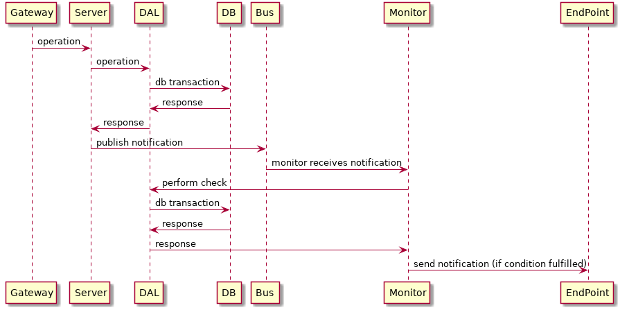

[](https://travis-ci.org/alb3rtobr/tfm_swcraftsmanship)

- [1. Introduction](#1-introduction)
  - [1.1. Project description](#11-project-description)
  - [1.2. Goals](#12-goals)
  - [1.3. Motivation](#13-motivation)
- [2. Theoretical framework](#2-theoretical-framework)
- [3. State of the art](#3-state-of-the-art)
  - [3.1. Kubernetes](#31-kubernetes)
    - [3.1.1. Minikube](#311-minikube)
    - [3.1.2. Helm](#312-helm)
  - [3.2. Microservices communication](#32-microservices-communication)
    - [3.2.1. REST](#321-rest)
    - [3.2.2. gRPC](#322-grpc)
    - [3.2.3. Apache Kafka](#323-apache-kafka)
  - [3.3. Persistence](#33-persistence)
    - [3.3.1. JPA & Hibernate](#331-jpa--hibernate)
    - [3.3.2. H2 & MySQL](#332-h2--mysql)
  - [3.4. Monitoring](#34-monitoring)
    - [3.4.1. Logging](#341-logging)
    - [3.4.2. Metrics](#342-metrics)
    - [3.4.3. Tracing](#343-tracing)
  - [3.5. Spring framework](#35-spring-framework)
- [4. Project development](#4-project-development)
  - [4.1. Methodology](#41-methodology)
  - [4.2. Analysis](#42-analysis)
  - [4.3. Design](#43-design)
  - [4.4. Implementation and tests](#44-implementation-and-tests)
    - [4.4.1. Version 0.1](#441-version-01)
    - [4.4.2. Version 0.2](#442-version-02)
    - [4.4.3. Version 0.3](#443-version-03)
  - [4.5. Prometheus](#45-prometheus)
    - [4.5.1. Deployment in Kubernetes](#451-deployment-in-kubernetes)
    - [4.5.2. Preparing the services to expose metrics](#452-preparing-the-services-to-expose-metrics)
    - [4.5.3. Custom Metrics](#453-custom-metrics)
  - [4.6. Deployment](#46-deployment)
    - [4.6.1. Installation](#461-installation)
      - [4.6.1.1. Docker image preparation](#4611-docker-image-preparation)
      - [4.6.1.2. Helm dependencies](#4612-helm-dependencies)
      - [4.6.1.3. Deployment](#4613-deployment)
      - [4.6.1.4. Delete the deployment](#4614-delete-the-deployment)
- [5. Results](#5-results)
- [6. Conclusions and future work](#6-conclusions-and-future-work)
- [7. References](#7-references)

# 1. Introduction

## 1.1. Project description

The current project aims to explore the development of a Kubernetes native application using Spring Cloud framework and study different alternatives for the problems identified.
We have implemented a simple application with the following requirements:
* REST API that exposes the allowed operations.
* Data Abstraction Layer service to access the data base via gRPC.
* Monitoring component who reacts to the operations performed in the data base.

Our application is a draft of a stock system that could be found on a shop or a warehouse. The application allows CRUD operations over generic items, create orders with items in stock, and it automatically performs order of new items to an external end point when the stock of an item is below a given threshold.

## 1.2. Goals

* **Implement a cloud native application from scratch, offering a REST API.**

* **Allow communication between microservices using a message bus service.**

* **Implement a service offering its functionality via gRPC.**

* **Develop our application in an incremental way, having functional versions after each iteration.**

## 1.3. Motivation

From the different topics we have covered during the Master, we found that Kubernetes and cloud applications were quite interesting. We also started working on cloud-related issues in our jobs, so we decided it would be very appropiate to explore this topic in our Master Thesis and take advantage of the learning opportunities we could find.

# 2. Theoretical framework

As starting point to understand our project theoretical environment, it is necessary to talk about microservices. A simple introductory definition would say that "Microservices are small, autonomous services that work together."[[1](#1)]. A software project that follows a microservices architecture is designed in such a way that its functionality is divided into smaller, loosely coupled components called services. Each service can be treated as a separate application, running its own process or processes. Services needs to communicate with each other, and they use lightweight protocols, being REST the most used.

This architecture has different advantages: reinforces modularity, it improves the reutilization of code, as services can be used in more than one application. Also, the codification of each service can be paralelized, reducing the implementation time of the whole application. Each service can use different programming languages or framework, so we can chose the solution that fits most with the service functionality, without being attached to a specific language.

On the other hand, these architectures also introduces several problems or issues that have to be addressed for a correct implementation of a microservices application. Distributed systems introduce complexity: the more services the application has, the harder is to coordinate all of them. As Martin Fowler points out, "Microservice proponents like to point out that since each service is smaller it's easier to understand. But the danger is that complexity isn't eliminated, it's merely shifted around to the interconnections between services."[[2](#2)]. Communication between services is key, so interfaces has to be well design, and infrastructure has to guarantee the appropriate latency in the message interchange process. The communication issue can impacts also in the delay of the transactions to be performed in the application: a given operation could need the answer for a bunch of microservices to be considered as done. If this process is not fast enough it can lead to a poor user experience.

# 3. State of the art

## 3.1. Kubernetes

Microservice architecture is not a new paradigm, but it has exponential importance specially due to the wide adoption of technologies such as Kubernetes. First, Docker popularized the usage of containers for implementation, testing, and distribution of applications, which contributed to the design of microservice applications. As commented in previous chapter, coordination of microservices (containers) was an issue to solve, and Kubernetes was the Google's answer: "Kubernetes is an open source system for managing containerized applications across multiple hosts; providing basic mechanisms for deployment, maintenance, and scaling of applications."[[3](#3)]
The first version was released by Google in 2014. After that, Google donated the product to the Linux Foundation, which created the Cloud Native Computing Foundation setting Kubernetes as the main technology behind. Actually, Kubernetes is the most used container orchestration tool and could being consider the de facto standard.

### 3.1.1. Minikube

For implementing our project we have used Minikube, a tool that allows to run Kubernetes locally on our laptops. This tool starts a minimum Kubernetes cluster, which fits perfectly for testing purposes or small applications.

### 3.1.2. Helm

We also named the management of the different services as a drawback of microservices architectures. Helm is a package manager that is used to define and manage services that run on Kubernetes. Applications and its resources are defined using yaml files called Helm charts. Our application include its own Helm charts since the first version.

## 3.2. Microservices communication

### 3.2.1. REST

We have already mentioned microservice communication is done through lightweight protocols. REST (Representational State Transfer) is the most used and we are using it too in this project. Services that follow this approach are called RESTful Web Services (RWS), and they provide an API to manipulate web resources.

### 3.2.2. gRPC

In our project we are also using other communication framework, called gRPC (Google Remote Procedure Call). It allows a client to call methods on a server application located on a different host transparently, as it is was a local object in the same machine. After defining the interface of the service to be implemented, the implementation of that interface has to be run in a host which will handle external client calls using a gRPC server.
The clients then can use a stub which provides the same interface, and it will be in charge to communicate with the gRPC server.
Server and client applications could be written in different languages, but they will communicate thanks to sharing the same interface.


*gRPC server and clients. (gRPC official site)*

By default, gRPC uses `protocol buffers` as mechanism to serialize structured data. With the specification of how your the data will be structured, it is possible to automatically generate source code to write and read that from different data streams and using different languages. `Protocol buffers` uses `.proto` files to define messages in its interface definition language (IDL), representing your data.

### 3.2.3. Apache Kafka

A third communication mechanism we are using in our project is Apache Kafka, an open source distributed streaming platform. Kafka allows services to publish and subscribe to stream of data, acting like a message queue. It can be used to build real-time streaming pipelines to collect data between different microservices. In our case, we implemented a producer-consumer model using Kafka as communication tool. Kafka works as a microservice in the Kubernetes cluster.

## 3.3. Persistence

### 3.3.1. JPA & Hibernate

### 3.3.2. H2 & MySQL

## 3.4. Monitoring

The transition to cloud native applications has meant an important change in the architecture and the way these new applications are deployed. The logic of an application deployed in a cloud system might be distributed among several services, each of them with several replicas and, even, each replica could be hosted in a volatile container though the infrastructure.

This new way of application deployment provides multitude of advantages. However it also increases the complexity in other areas, such the monitoring. Due to an application can be composed by several microservices, the integration between them increases considerably and the possibility of bottlenecks through the service chain is increased also, maybe due to the own microservice logic or even because of problems in the infrastructure. That is why it was needed to reinvent the paradigm about how to monitor Cloud Native Applications.

A Cloud Native Application could be monitored in two ways: following the *black box* or *white box* approaches. The first one, as its name implies, consists in querying the application from outside as it will be a black box and monitoring the results. The *white box* approach implies to monitor the application from inside, taking into account each of the elements of the application and infrastructure. There are several aspects that may help us to monitor a Cloud Native Application as a *white box*:

* Logging
* Metrics
* Tracing

### 3.4.1. Logging

### 3.4.2. Metrics

TODO: Prometheus and Grafana

### 3.4.3. Tracing

## 3.5. Spring framework

# 4. Project development

## 4.1. Methodology

Cloud technologies evolve so fast and there are so many alternatives available, that when we were defining the scope of this project we elaborated a huge list of "nice-to-have" features. We decided that the best approach to develop our application was following an incremental approach, and it would allow us to keep focus on the tasks we have to perform, and prioritize issues accordingly. As each phase of our application has to provide functionality, we forced us not to start too many issues at the same time, and focus on finishing the open ones. This approach has resulted to be very useful for us, because although it was clear that we were not going to finish all the items of our first list, we are releasing an application that at least can provide some functionality.

Trying to take advantage of all the learning opportunities during the development of this project, we decided to use two tools that are widely used in software development, but we are not familiar with: Slack & GitHub.

Before this project, we were used to work with GitHub as source code repository, but we wanted to go one step beyond and use it also as project management tool, using features as the issue tracker and the usage of pull requests for code review. This allowed us to get experience on its usage and get familiar with the common GitHub way of working.

Slack ("Searchable Log of All Conversation and Knowledge" [[4](#4)]) is a team collaboration tool, useful to coordinate distributed teams. We create our own Slack workspace, and it was our main communication mechanism during the project. In our workspace, we create a separate channel to talk about each component, so all the discussions, questions, issues... were properly organized.
We also took advantage of the different Slack plugins: we integrated both our GitHub repository and our continuous integration mechanism, so every activity generated in any of both platform was reported in its associated channel in Slack. This has proven to be very useful in a team which members are not working in the same physical place and not even at the same hours.


*Travis CI reports in Slack.*


*Github activity reports in Slack.*

We defined a base architecture to be evolved. We added the required tasks as GitHub issues, and organized them in milestones.
When an issue was assigned, the developer worked on a separate branch, and once he was done, a pull request was opened in order to review the code before merging it to master branch.

## 4.2. Analysis

This is the base architecture we decided to develop:


We decided to have the following components/services:
* `Gateway` : handling cluster access.
* `Application server` : main logic of the application.
* `Monitor` : in charge of monitoring the server activity, and send a notification to an external end point if a given condition is fulfilled.
* `Message bus` : communication mechanism used by the server to publish events, and used by the monitor to consume those events.
* `DAL` : data abstraction layer to isolate the business model from the persistence of the model itself.
* `Data base` : the persistence of the model.

At this phase, we draft our main use case as follows:


## 4.3. Design

After prioritize which technologies we were interested on, the architecture draft was completed to look as follows:


The application is composed of the following services:
* `API gateway` : we used Kubernetes Ingress functionality as first approach.
* `restapi` : in charge of offering our application functionality via REST API.
* `dal` : using gRPC to access the model
* `stockchecker` : whenever an item is sold, if the remaining stock is less than a given threshold, it will raise a notification to a external REST end point.

## 4.4. Implementation and tests

We have implemented our application on a incremental way.

### 4.4.1. Version 0.1

Main characteristics:
* Basic functionality of all the components
* Kafka setup
* Helm charts
* ConfigMaps
* Automatic test execution for every commit

In this first version of the application we setup the Github repository, and the different projects. The application can be started using Helm charts, and configured using configmaps. ConfigMaps are a Kubernetes resource that allows to inject configuratioin to the running containers, splitting the services definition and the values used for configuration.

An important issue we solved was the Kafka configuration to communicate the `restapi` & `stockchecker` services. Thanks to Helm, the configuration of the Kafka cluster was very straightforward, but we spent quite some time with the setup of the both services to use Kafka.

At this stage of the application development, the model is very simple, containing just one entity, `Item`, which has an `id` and a `description` as attributes.


 The `restapi` component offers CRUD operations for `Item`:
 * POST `api/v1/items` : create an item
 * GET `api/v1/items` : list all items
 * GET `api/v1/items/{id}` : get an item
 * PUT `api/v1/items/{id}` : update an item
 * DELETE `api/v1/items/{id}` : delete an item


*Screenshoot of Postman while creating an item*

Although our `stockchecker` is able to send external REST notifications, taking into account the return of time invested, we decided to configure it just to log the notifications. Otherwise it would force us to implement that external end point in our tests.

Finally, one of the features we thought that would be nice to have, was a continuous integration (CI) setup. Although this was not a priority due to the topic of the project, being this Master about Software Craftsmanship, we decided to give it a chance and check how far we could go without spending too much time. During the course we learnt there are several CI tools that could be integrated with Github projects. We selected one of them, Travis CI, to automatically run our tests when a commit is sent to our repository. The `.travis.yml` file contains the different stages we run for every commit. Our Travis dashboard can be found in `https://travis-ci.org/alb3rtobr/tfm_swcraftsmanship`.

### 4.4.2. Version 0.2

Main characteristics:
* Model extension to include more than one relation
* Ingress configuration

The second version included a significant change in the model:


The `restapi` component offers the same operations than previous version for `Item` objects and new operations due to the new model:
* POST `api/v2/items` : create an item
* GET `api/v2/items` : list all items
* GET `api/v2/items/{id}` : get an item
* PUT `api/v2/items/{id}` : update an item
* DELETE `api/v2/items/{id}` : delete an item
* POST `api/v2/orders` : create a order (`DomainOrder`)
* GET `api/v2/orders` : list all orders
* GET `api/v2/orders/{id}` : list an orders
* PUT `api/v2/orders/{id}` : update an order
* DELETE `api/v2/orders/{id}` : delete an order

In this version it is possible to create orders of items.

We also implemented a quick improvement for the API gateway. In previous version, access to `restapi` was performed using the `NodePort` option available in Kubernetes services. This automatically creates an IP which is accessed from outside the Kubernetes cluster, and together with the `NodePort` provides access to the `restapi` service. In version 0.2 we complemented this by configuring `Ingress`, a Kubernetes resource that manages external access to the cluster services, and provides load balancing.

Before configuring ingress, it is necessary to configure an ingress controller. In our case, we used Nginx Ingress Controller. It can be installed using Helm:
```
$> helm install --name nginx-ingress stable/nginx-ingress
```
In case of using Minikube, as it was our case, it is necessary to enable ingress:
```
$> minikube addons enable ingress
```

### 4.4.3. Version 0.3

*Under development*

## 4.5. Prometheus

Prometheus is an open-source tool used mainly in cloud applications for monitoring and alerting purposes.

The following diagram illustrates the architecure of Prometheus and some of its more important components:


Prometheus scrapes metrics from instrumented jobs, directly or via push gateway. It stores all the obtained metrics locally and offers the posibility of execute rules over the stored data or generate alerts. Even, this data may be graphicaly represented using tools as *Grafana*, also used in the development of this project.

For the aim of this project only the monitoring part of Prometheus was used but it could be adapted in the future to take advantage of the Alert system.

### 4.5.1. Deployment in Kubernetes

TBD

NOTE: Here we have to explain we have used Prometheus Operator Chart:

* Explain what is Prometheus Chart
* How to get the chart
* How to provide the configuration to Prometheus

### 4.5.2. Preparing the services to expose metrics

Each of the services that take part of our deployments need to be adapted in order to generate and expose metrics. Thanks to the use of Spring framework we can take advantage of Actuator. This library provided by Spring framework provide us the posibility of exposing operational information about the running application (health, metrics, dump, info, etc.). It uses HTTP endpoints or JMX beans to enable us to interact with it.

If we want to configure Actuator in one of our services, we only have to add a new dependency in the `pom.xml` file:

```xml
        <!-- Actuator -->
        <dependency>
            <groupId>org.springframework.boot</groupId>
            <artifactId>spring-boot-starter-actuator</artifactId>
        </dependency>
```

With Spring boot 2.0, adding Prometheus support to Spring boot became a lot easier thanks to the integration of Micrometer. Micrometer can be compared to what slf4j does for logging, but for monitoring instead. It provides a clean API that can be accessed, and has a bridge to many monitoring platforms, including Prometheus.

To be able to monitor our application within Spring boot, we need to add the following dependency (in addition of Spring Actuator one):

```xml
        <!-- Metrics and Prometheus -->
        <dependency>
            <groupId>io.micrometer</groupId>
            <artifactId>micrometer-registry-prometheus</artifactId>
        </dependency>
```

By default, the Prometheis endpoint provided by Actuator is not available and must be exposed via configuration. For this, in the `application.properties` file of the application it is needed to add the following lines:

```yaml
    management:
      endpoints:
          web:
            exposure:
              include: prometheus
```

If we run the aplication and access the url `http://<service_ip>:<service_port>/actuator` we will get all the exposed Actuator endpoints:

```json
{
   "_links":{
      "self":{
         "href":"http://10.105.135.202:8080/actuator",
         "templated":false
      },
      "prometheus":{
         "href":"http://10.105.135.202:8080/actuator/prometheus",
         "templated":false
      }
   }
}
```

And, finally, it is needed to configure Prometheus in order to know where to scrape the metrics. We will need to add one job per service to be scraped.

```yaml
prometheus-operator:
  prometheus:
    prometheusSpec:
      additionalScrapeConfigs:
        - job_name: 'restapi-service'
          scrape_interval: 1m
          metrics_path: '/actuator/prometheus'
          static_configs:
            - targets: ['tfm-almacar-restapi:8080']
```

### 4.5.3. Custom Metrics

In addition to the metrics provided by Actuator, it is possible to create our own Custom Metrics. Micrometer allow us to use the MeterRegistry to store in memory all the counters needed. Thanks to the magic of Spring, Micrometer will autoconfigure the MeterRegistry depending on the dependencies we used in our project. As we are using `micrometer-registry-prometheus` as dependency, the registry will be compatible with Prometheus.

For the purpose of this project we have decided to create two counters in the DAL service to measure when each of the gRPC Services are called:

* item_grpc_request_total: Number of requests to Item gRPC service
* order_grpc_request_total: Number of requests to Order gRPC service

In order to prepare the DAL microservice to increment these counters when a gRPC request comes, we just need to provide to the gRPC services an instance of the MeterRegistry class:

```java
@Configuration
public class DalConfig {
[...]

    @Autowired
    MeterRegistry meterRegistry;

    @Bean
    public GrpcServer grpcServer() {

        [...]

        ItemPersistenceService itemService = new ItemPersistenceService(itemDAO, entityConversion, meterRegistry);
        OrderPersistenceService orderService = new OrderPersistenceService(orderDAO, entityConversion, meterRegistry);

        List<BindableService> services = new ArrayList<BindableService>();
        services.add(itemService);
        services.add(orderService);

        GrpcServer grpcServer = new GrpcServer(services);
        return grpcServer;
    }

}
```

So, each of the gRPC services will have available the MetricRegistry, injected by constructor:

```java
public class ItemPersistenceService extends ItemPersistenceServiceImplBase {
    private static final Logger LOGGER = LoggerFactory.getLogger(ItemPersistenceService.class);

    private ItemDAO itemPersistence;
    private EntityConversion conversionLogic;
    private final Counter itemGrpcRequestCounter;

    public ItemPersistenceService(ItemDAO itemsPersistence, EntityConversion conversionLogic, MeterRegistry registry) {
        this.itemPersistence = itemsPersistence;
        this.conversionLogic = conversionLogic;
        itemGrpcRequestCounter = Counter
            .builder("item_grpc_request")
            .description("Number of requests to Item gRPC service")
            .register(registry);
    }

    [...]
}
```

Thus, we only just have to increase the counter when a gRPC method is called from the service. For example, when we create an Item:

```java
public class ItemPersistenceService extends ItemPersistenceServiceImplBase {
    [...]

    @Override
    public void create(CreateItemRequest request, io.grpc.stub.StreamObserver<CreateItemResponse> responseObserver) {
        itemGrpcRequestCounter.increment();

        [...]
    }

    [...]
}
```

## 4.6. Deployment

### 4.6.1. Installation

#### 4.6.1.1. Docker image preparation

`build.sh` script can be used to compile all the services and generate the Docker images.
When executed, the following steps are performed:
* Build `proto-idls` project
* Build `restapi` project & generate Docker image
* Build `stockchecker` project & generate Docker image
* Build `dal` project & generate Docker image

#### 4.6.1.2. Helm dependencies

The application chart has dependendecies in external Chart files for Kafka and Zookeeper services. It is needed, prior the application deployment, to update the helm dependencies in order to download the charts for these services.

First it is needed to install the Helm Incubator repository:

```bash
$ helm repo add incubator https://kubernetes-charts-incubator.storage.googleapis.com/
"incubator" has been added to your repositories
```

And update the dependencies:

```bash
$ cd $GIT_REPO/charts
$ helm dependency update tfm-almacar
Hang tight while we grab the latest from your chart repositories...
...Unable to get an update from the "local" chart repository (http://127.0.0.1:8879/charts):
	Get http://127.0.0.1:8879/charts/index.yaml: dial tcp 127.0.0.1:8879: connect: connection refused
...Successfully got an update from the "incubator" chart repository
...Successfully got an update from the "stable" chart repository
Update Complete. ⎈Happy Helming!⎈
Saving 1 charts
Downloading kafka from repo https://kubernetes-charts-incubator.storage.googleapis.com/
Deleting outdated charts
```

#### 4.6.1.3. Deployment

```bash
$ cd $GIT_REPO/charts
$ helm install --name=tfm-almacar tfm-almacar
```
The deployment is the following:

```
NAME                                            READY   STATUS    RESTARTS   AGE
pod/tfm-almacar-dal-84896976db-wc2cp            1/1     Running   2          23h
pod/tfm-almacar-kafka-0                         1/1     Running   3          23h
pod/tfm-almacar-mysql-fd97cb567-zbw8w           1/1     Running   0          23h
pod/tfm-almacar-restapi-bc6cfd455-2qhc8         1/1     Running   0          23h
pod/tfm-almacar-stockchecker-7ff8d66486-rlz6g   1/1     Running   4          23h
pod/tfm-almacar-zookeeper-0                     1/1     Running   0          23h
pod/tfm-almacar-zookeeper-1                     1/1     Running   0          23h
pod/tfm-almacar-zookeeper-2                     1/1     Running   0          23h

NAME                                     TYPE        CLUSTER-IP       EXTERNAL-IP   PORT(S)                      AGE
service/kubernetes                       ClusterIP   10.96.0.1        <none>        443/TCP                      64d
service/tfm-almacar-dal                  ClusterIP   10.105.42.213    <none>        50057/TCP                    23h
service/tfm-almacar-kafka                ClusterIP   10.102.174.201   <none>        9092/TCP                     23h
service/tfm-almacar-kafka-headless       ClusterIP   None             <none>        9092/TCP                     23h
service/tfm-almacar-mysql                ClusterIP   10.101.230.4     <none>        3306/TCP                     23h
service/tfm-almacar-restapi              NodePort    10.100.175.116   <none>        8787:31034/TCP               23h
service/tfm-almacar-zookeeper            ClusterIP   10.100.139.119   <none>        2181/TCP                     23h
service/tfm-almacar-zookeeper-headless   ClusterIP   None             <none>        2181/TCP,3888/TCP,2888/TCP   23h

NAME                                       READY   UP-TO-DATE   AVAILABLE   AGE
deployment.apps/tfm-almacar-dal            1/1     1            1           23h
deployment.apps/tfm-almacar-mysql          1/1     1            1           23h
deployment.apps/tfm-almacar-restapi        1/1     1            1           23h
deployment.apps/tfm-almacar-stockchecker   1/1     1            1           23h

NAME                                                  DESIRED   CURRENT   READY   AGE
replicaset.apps/tfm-almacar-dal-84896976db            1         1         1       23h
replicaset.apps/tfm-almacar-mysql-fd97cb567           1         1         1       23h
replicaset.apps/tfm-almacar-restapi-bc6cfd455         1         1         1       23h
replicaset.apps/tfm-almacar-stockchecker-7ff8d66486   1         1         1       23h

NAME                                     READY   AGE
statefulset.apps/tfm-almacar-kafka       1/1     23h
statefulset.apps/tfm-almacar-zookeeper   3/3     23h

```

#### 4.6.1.4. Delete the deployment

```bash
$ helm del --purge tfm-almacar
```

# 5. Results

*TBD*

# 6. Conclusions and future work

*TBD*

# 7. References

* [1]: "Building Microservices", Sam Newman, O'Reilly Media
* [2]: [Microservice Trade-Offs](https://www.martinfowler.com/articles/microservice-trade-offs.html), Martin Fowler
* [3]: [Kubernetes Github repository](https://github.com/kubernetes/kubernetes)
* [3]: [Slack, the red hot $3.8 billion startup, has a hidden meaning behind its name"](https://www.businessinsider.com/where-did-slack-get-its-name-2016-9), Bussiness Insider

Reference sites:
* [Kubernetes](https://kubernetes.io/)
* [Spring Cloud](https://spring.io/projects/spring-cloud)
* [gRPC](https://grpc.io/)
* [Apache Kafka](https://kafka.apache.org/)

Spring Kafka related links:
* [Spring Kafka - Spring Boot example](https://codenotfound.com/spring-kafka-boot-example.html)
* [Spring Kafka Consumer-Producer example](https://codenotfound.com/spring-kafka-consumer-producer-example.html)
* [Spring Kafka - JSON Serializer Deserializer Example](https://codenotfound.com/spring-kafka-json-serializer-deserializer-example.html)
* [Spring Kafka Embedded Unit Test Example](https://codenotfound.com/spring-kafka-embedded-unit-test-example.html)
